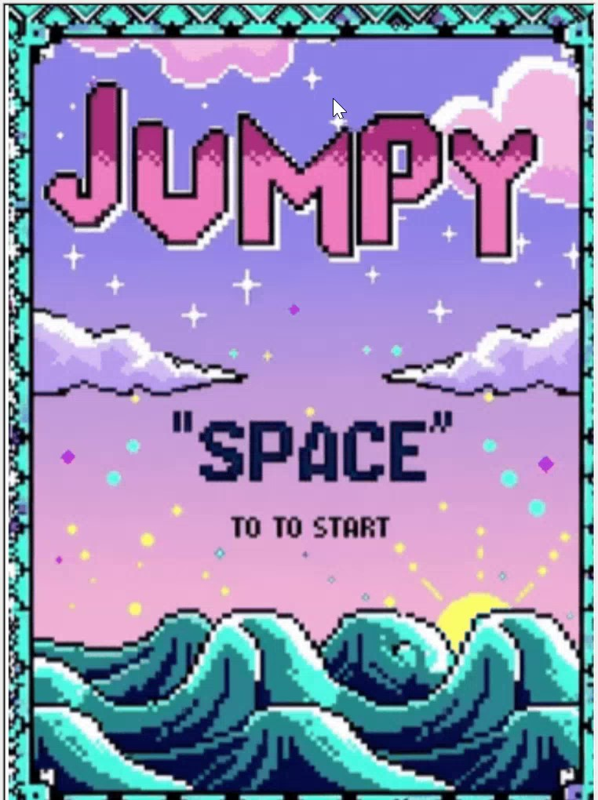
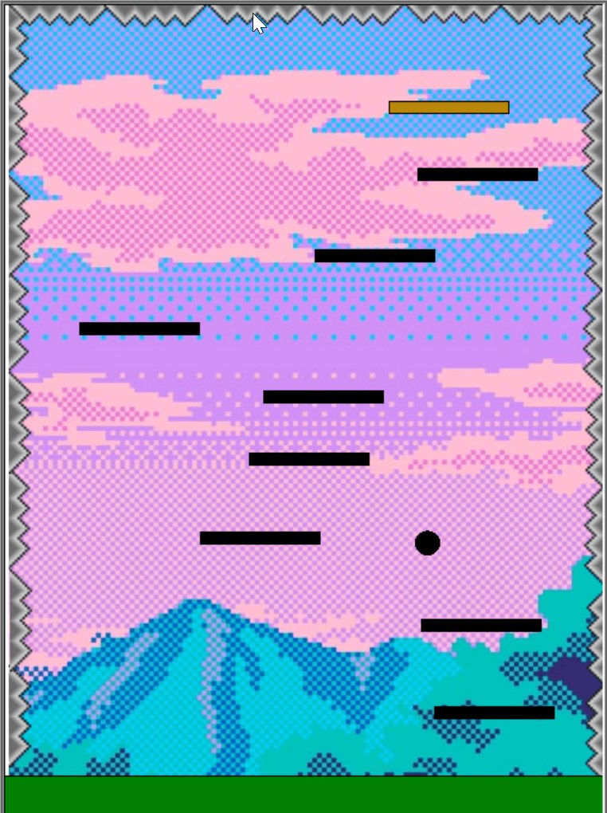

# 🎮Game description🐢

Jumpy is a concept plataformer videogame🎮 primarily designed with the python [turtle🐢](https://docs.python.org/3/library/turtle.html) library.

---

Although this library is mostly used for painting, I've managed to design a simple game which implements:
- Randomized scenario
- Time management through a mechanic with which the more time the jump button is pressed, the higher the jump
- Gravity physics
- Object collision detection
- Animations in titleScreen and when winning

---
Some screenshots:

  
  
  

---

The objective of the game is to reach the golden platform by moving horizontally with "a" and "d" keys; and jumping with "w" key. The main mechanic is that the more time "w" is pressed, the higher the jump.
